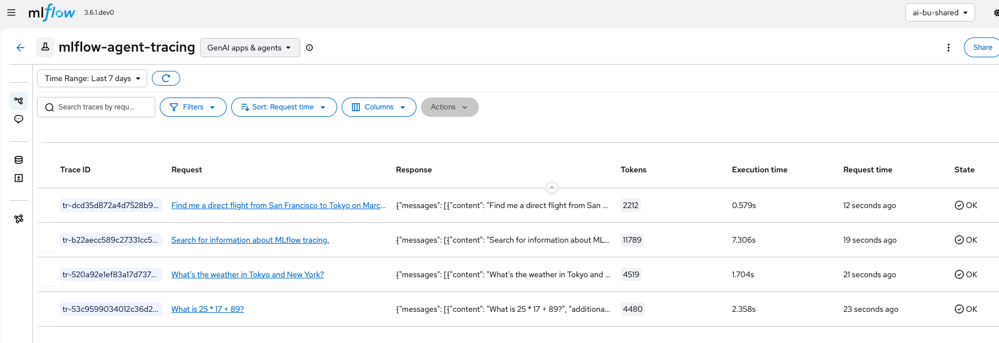
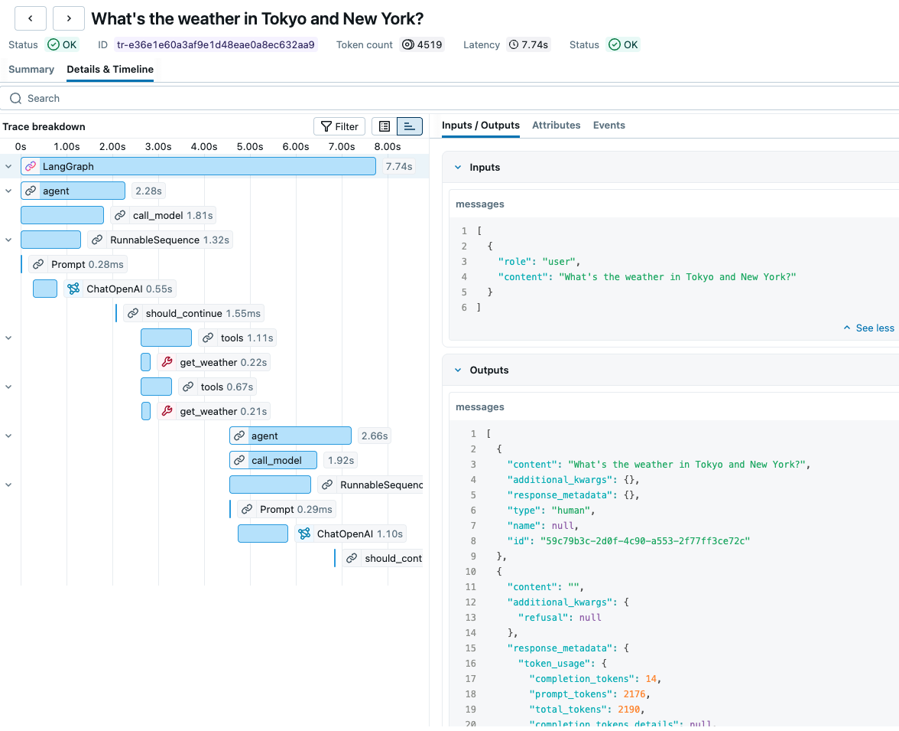
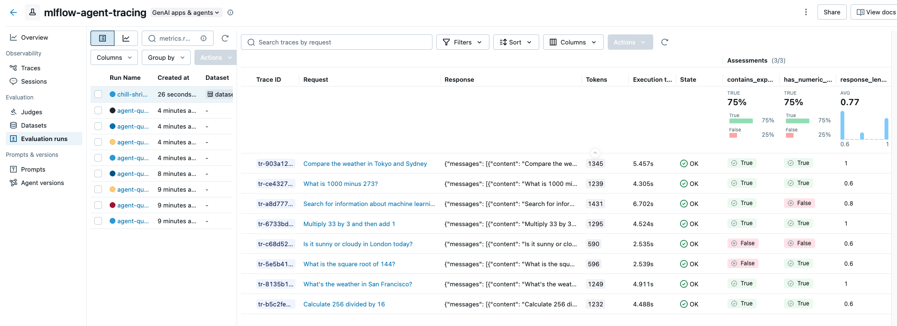
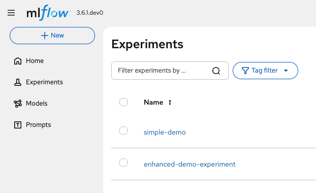
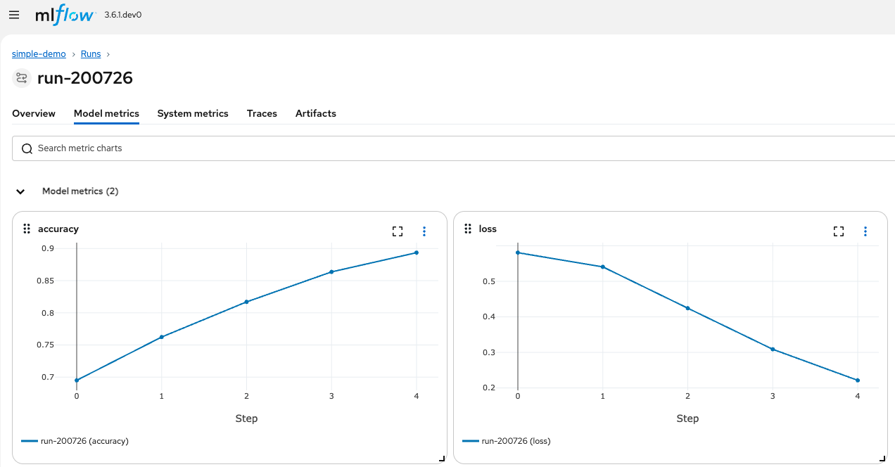

# MLflow on Red Hat OpenShift AI

This repository contains examples and documentation for using **MLflow on Red Hat OpenShift AI (RHOAI)**.

## Overview

MLflow is an open-source platform for managing the end-to-end machine learning lifecycle. This repo demonstrates:

1. **Agent Tracing** - Trace AI agent execution with LangChain/LangGraph
2. **Experiment Tracking** - Log parameters, metrics, and artifacts from ML training

---

## MLflow on RHOAI Setup

### Enable the MLflow Operator

Enable the MLflow operator through the RHOAI 3.2+ Platform operator:

```bash
kubectl patch datasciencecluster default-dsc \
  --type=merge \
  -p '{"spec":{"components":{"mlflowoperator":{"managementState":"Managed"}}}}'
```

### Deploy MLflow

For a simple quickstart, deploy MLflow using SQLite and artifact storage on a PersistentVolumeClaim (PVC):

```bash
cat <<'EOF' | kubectl apply -f -
apiVersion: mlflow.opendatahub.io/v1
kind: MLflow
metadata:
  name: mlflow
spec:
  storage:
    accessModes:
      - ReadWriteOnce
    resources:
      requests:
        storage: 100Gi
  backendStoreUri: "sqlite:////mlflow/mlflow.db"
  artifactsDestination: "file:///mlflow/artifacts"
  serveArtifacts: true
  image:
    imagePullPolicy: Always
EOF
```

> **Note:** This works from RHOAI 3.2 onwards.

### Access MLflow UI

Get the MLflow UI URL from the OpenShift route:

```bash
DS_GW=$(oc get route data-science-gateway -n openshift-ingress -o template --template='{{.spec.host}}')
echo "MLflow UI: https://$DS_GW/mlflow"
```

The MLflow UI is also accessible from the Applications drop-down in the OpenShift console or RHOAI/ODH dashboard navigation bar.

---

## Agent Tracing

The `agent-tracing/` folder contains a complete example of tracing AI agent execution with MLflow.

### Features

- **LangGraph ReAct Agent** with tool use
- **MaaS integration** (Model as a Service) with configurable models
- **MCP tools** from Kiwi travel API
- **Automatic tracing** with `mlflow.langchain.autolog()`
- **GenAI Evaluation** with custom scorers

### Quick Start

```bash
cd agent-tracing
pip install -r requirements.txt

# Configure environment (see agent-tracing/README.md for details)
export MAAS_API_KEY=your-api-key
export MLFLOW_TRACKING_URI=https://data-science-gateway.XXX/mlflow
# ... other variables
envsubst < .env.example > .env

# Run the agent with tracing
python run_tracing_demo.py

# Run evaluation
python evaluate_agent.py
```

See [agent-tracing/README.md](agent-tracing/README.md) for full documentation.

### Trace List View

The MLflow Traces tab shows all agent executions with request/response, token counts, and execution times:



### Trace Breakdown (Span Details)

Clicking on a trace shows the full execution breakdown with nested spans for each step (LLM calls, tool invocations, etc.):



### GenAI Evaluation

The evaluation framework uses `mlflow.genai.evaluate()` with custom scorers to assess agent performance:



Metrics include:
- **contains_expected**: Whether the response contains the expected answer
- **has_numeric_result**: Whether the response includes numeric values
- **response_length**: Score based on response verbosity

> **NOTE:** The trace breakdown view showing detailed spans requires **MLflow 3.9+**. This is **not available in RHOAI 3.2** due to gateway limitations that don't expose the `/api/2.0/mlflow/traces/get` endpoint. The screenshots below are from an ODH MLflow 3.9 deployment.

---

## Experiment Tracking

The `experiments/` folder contains basic MLflow experiment tracking examples.

See [experiments/README.md](experiments/README.md) for setup and usage details.



